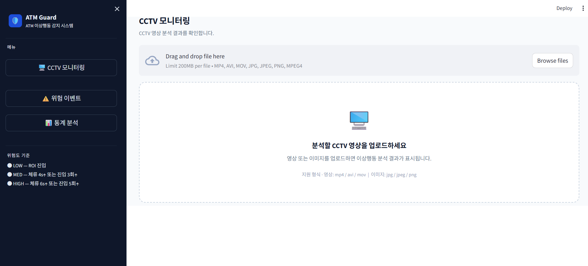
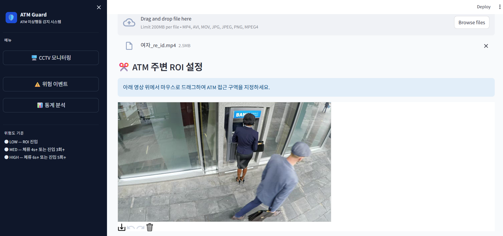
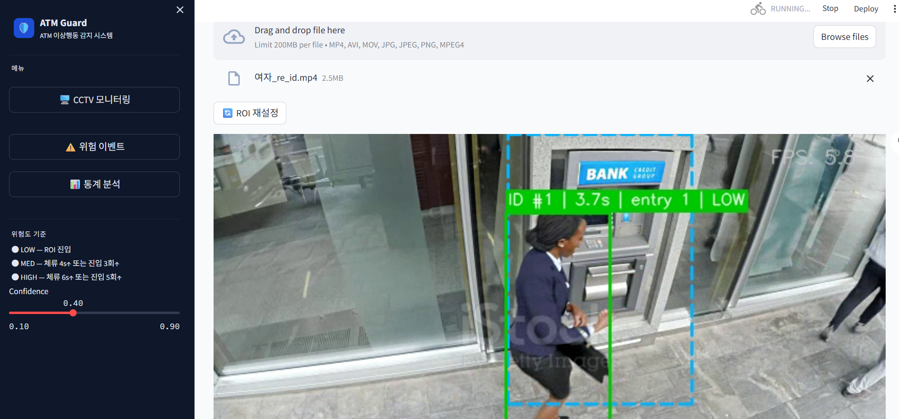
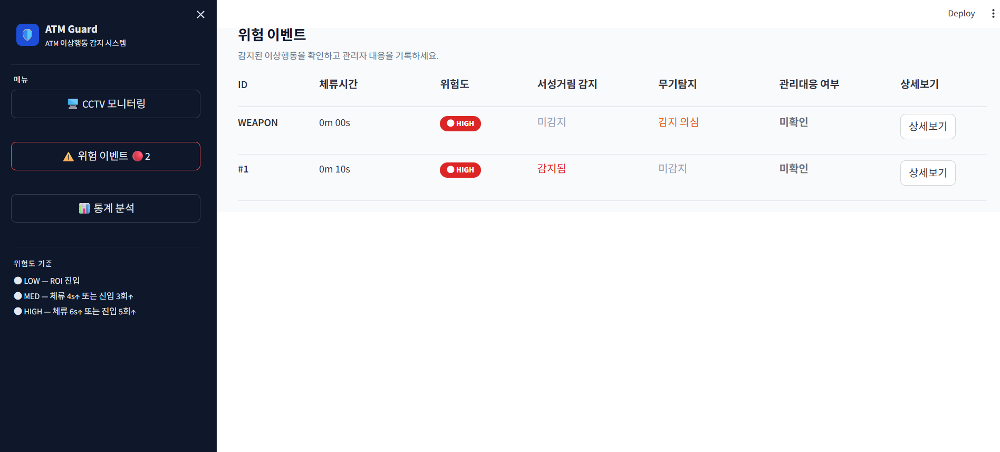
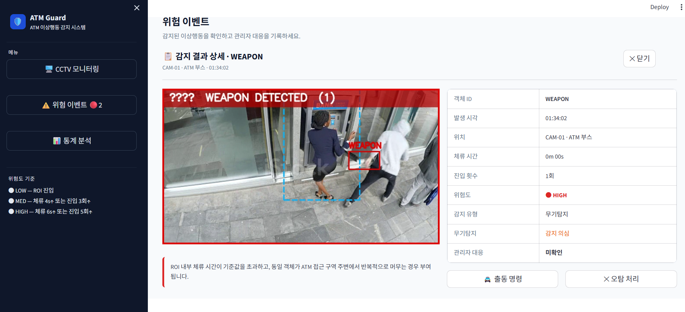
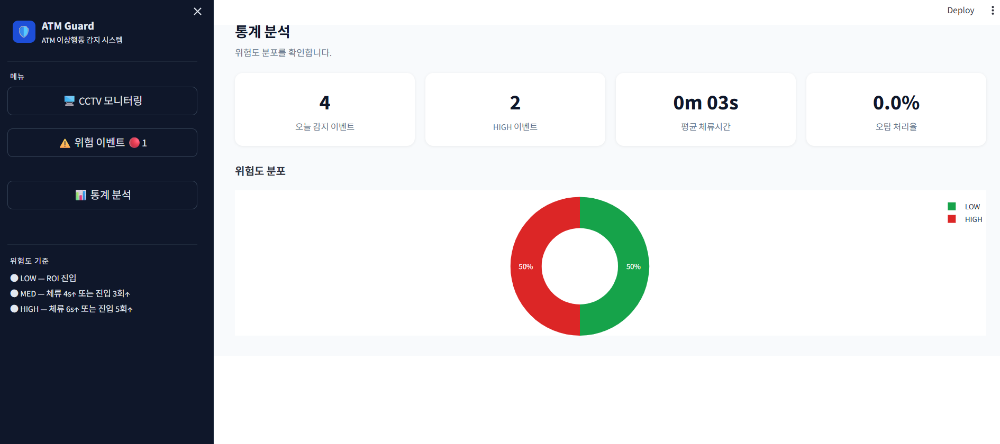

# 🛡️ATM Guard

**ATM Guard**는 ATM 부스 주변 CCTV 영상에서 사람과 무기 객체를 탐지하고, ByteTrack 기반 객체 추적과 ROI 기반 이벤트 분석을 결합하여 서성거림 및 위험 상황을 감지하는 Streamlit 기반 웹 애플리케이션입니다.

본 프로젝트는 단순 객체 탐지 결과를 출력하는 데서 그치지 않고, ATM 접근 구역을 ROI로 지정한 뒤 객체별 체류 시간, ROI 진입 횟수, 추적 ID 유지 여부를 분석하여 위험도를 산출합니다. 또한 감지된 이벤트를 관리자에게 보여주고, 출동 또는 오탐 처리를 기록할 수 있는 간단한 관제 워크플로우를 제공합니다.

---

## 1. 주요 기능

### 1.1 CCTV 영상 / 이미지 업로드



사용자는 Streamlit 웹 앱에서 CCTV 영상 또는 이미지를 업로드할 수 있습니다.

지원 형식은 다음과 같습니다.

- 영상: `mp4`, `avi`, `mov`
- 이미지: `jpg`, `jpeg`, `png`

영상 파일을 업로드하면 첫 프레임을 추출하여 ROI 설정 단계로 넘어가고, 이미지 파일을 업로드하면 단일 이미지 객체 탐지를 수행합니다.

---

### 1.2 ROI 설정



ATM 주변 영역을 관심 구역, 즉 ROI로 지정합니다.

사용자는 업로드한 영상의 첫 프레임 위에서 마우스로 사각형을 드래그하여 ATM 접근 구역을 설정할 수 있습니다. 이후 분석 과정에서는 객체의 중심점이 ROI 내부에 들어왔는지 판단하여 체류 시간과 진입 횟수를 계산합니다.

---

### 1.3 Object Detection

YOLOv8 기반 객체 탐지 모델을 사용하여 프레임 단위로 객체를 탐지합니다.

탐지 대상 클래스는 다음과 같습니다.

- `person`
- `weapon`

`person` 클래스는 추적 및 서성거림 판단에 사용되며, `weapon` 클래스는 ATM 파손 또는 위협 상황 감지를 위한 위험 이벤트 생성에 사용됩니다.

---

### 1.4 Object Tracking



YOLO 탐지 결과에 ByteTrack을 적용하여 객체별 고유 Track ID를 부여합니다.

이를 통해 단일 프레임의 객체 탐지 결과가 아니라, 영상 전체에서 동일 객체가 ROI에 얼마나 오래 머물렀는지, 몇 번 접근했는지를 누적 분석할 수 있습니다.

---

### 1.5 Re-ID 기반 ID 유지 보정

CCTV 환경에서는 사람이 다른 사람에게 가려지거나, 프레임에서 잠시 사라졌다가 다시 등장하면서 Track ID가 바뀌는 문제가 발생할 수 있습니다.

이를 보완하기 위해 본 프로젝트에서는 간단한 Re-ID 로직을 구현했습니다.

- 사라진 객체를 `lost_tracks` 후보로 보관
- 새로 등장한 Track ID와 기존 lost track의 색상 히스토그램 비교
- 중심점 거리와 색상 유사도를 함께 고려
- 유사도가 기준 이상이면 새 Track ID를 기존 ID로 매핑
- 기존 객체의 체류 시간, 진입 횟수, 위험도 상태 유지

이를 통해 일시적인 occlusion 또는 ID switch 상황에서도 동일 객체의 행동 상태가 끊기지 않도록 개선했습니다.

---

### 1.6 ROI-based 이상행동 분석

각 Track ID에 대해 다음 정보를 누적 관리합니다.

- ROI 내부 여부
- ROI 진입 횟수
- ROI 내부 체류 프레임 수
- 체류 시간
- 현재 위험도
- 서성거림 감지 여부

기본 위험도 기준은 `config.py`에서 조정할 수 있습니다.

| 위험도 | 기준                                                            |
| ------ | --------------------------------------------------------------- |
| LOW    | ROI 내부 진입                                                   |
| MED    | 체류 시간이 MED 기준 이상이거나 ROI 진입 횟수가 MED 기준 이상   |
| HIGH   | 체류 시간이 HIGH 기준 이상이거나 ROI 진입 횟수가 HIGH 기준 이상 |

현재 데모용 기본값은 다음과 같습니다.

```python
LOW_DWELL_SECONDS  = 2
MED_DWELL_SECONDS  = 4
HIGH_DWELL_SECONDS = 6

MED_ENTRY_COUNT  = 3
HIGH_ENTRY_COUNT = 5
```

실제 운영 환경에서는 영상 길이, FPS, ATM 부스 구조에 맞게 기준값을 조정해야 합니다.

---

### 1.7 이상행동 이벤트

이상행동 이벤트는 크게 두 가지로 생성됩니다.

| 이벤트 유형     | 설명                                                                          |
| --------------- | ----------------------------------------------------------------------------- |
| Loitering Event | 동일 객체가 ATM 접근 ROI에 반복적으로 진입하거나 일정 시간 이상 체류하는 경우 |
| Weapon Event    | YOLO 모델이 weapon 객체를 탐지한 경우                                         |

Loitering 이벤트는 같은 Track ID에 대해 중복 생성하지 않고, 기존 이벤트의 위험도와 체류 시간, 진입 횟수를 갱신하는 방식으로 관리합니다.

Weapon 이벤트는 과도하게 중복 생성되지 않도록 이벤트 쿨다운을 적용합니다.

---

### 1.8 Streamlit Dashboard

Streamlit 기반 대시보드는 다음 페이지로 구성됩니다.

| 페이지        | 기능                                                                         |
| ------------- | ---------------------------------------------------------------------------- |
| CCTV 모니터링 | 영상/이미지 업로드, ROI 설정, 실시간 분석 결과 출력                          |
| 위험 이벤트   | 감지된 이벤트 목록 확인, 상세보기, 출동/오탐 처리                            |
| 통계 분석     | 전체 이벤트 수, HIGH 이벤트 수, 평균 체류시간, 오탐 처리율, 위험도 분포 확인 |





---

## 2. Repository Structure

```text
ATM-Guard/
├── app.py
├── config.py
├── inference.py
├── event_logic.py
├── draw_utils.py
├── roi_utils.py
├── bytetrack_custom.yaml
├── requirements.txt
│
├── assets/
│   └── styles.css
│
├── pages/
│   ├── cctv_page.py
│   ├── events_page.py
│   └── stats_page.py
│
├── services/
│   └── analysis_service.py
│
├── state/
│   └── session_state.py
│
├── ui/
│   ├── sidebar.py
│   └── styles.py
│
├── weights/
│   ├── best.pt      # GitHub에는 업로드하지 않음
│   └── best.onnx    # GitHub에는 업로드하지 않음
│
└── docs/
    └── screenshots/
        ├── 01_upload_screen.png
        ├── 02_roi_setting.png
        ├── 03_cctv_analysis.png
        ├── 04_event_log.png
        ├── 05_event_detail.png
        └── 06_stats_page.png
```

---

## 3. Data Pipeline

### 1. Data Collection & Annotation

- 기존 공개 데이터셋 활용
- ATM 환경에 맞는 커스텀 데이터 수집
- 사람(Person) 및 무기(Weapon) 객체 직접 라벨링
- YOLO 형식 데이터셋 구축

↓

### 2. Model Training

- YOLOv8 기반 객체 탐지 모델 학습
- 사람 및 무기 클래스 학습
- 최적 모델(best.pt) 생성

↓

### 3. Object Detection

- CCTV 영상 입력
- YOLOv8을 이용한 프레임 단 객체 탐지
- Bounding Box 및 Confidence Score 생성

↓

### 4. Object Tracking

- ByteTrack을 이용한 객체 추적
- 객체별 고유 Track ID 부여
- 프레임 간 동일 객체 유지
- 일시적 가림 또는 ID 변경 문제를 완화하기 위해 Re-ID 로직 적용

↓

### 5. ROI-based Behavior Analysis

- ATM 영역(ROI) 설정
- 체류 시간(Dwell Time) 측정
- ATM 접근 횟수 계산
- 체류 시간과 진입 횟수를 기준으로 LOW / MED / HIGH 위험도 산출

↓

### 6. Event Generation

- 무기 탐지
- ROI 내부 장시간 체류 또는 반복 접근 시 서성거림(Loitering) 이벤트 생성
- 이벤트별 객체 ID, 체류 시간, 진입 횟수, 위험도, 발생 시각 기록

↓

### 7. Visualization

- Streamlit Dashboard 제공
- CCTV 화면 위에 Bounding Box, Track ID, ROI, 위험도, FPS 표시
- 객체 정보 및 이벤트 로그 출력
- 관리자가 이벤트에 대해 출동 / 오탐 처리를 기록
- 통계 분석 페이지에서 이벤트 수, HIGH 이벤트 수, 평균 체류시간, 오탐 처리율, 위험도 분포 확인

---

## 4. Model Weights

학습된 모델 가중치 파일은 저장소에 포함하지 않습니다.

아래 링크에서 모델 파일을 다운로드한 뒤, 프로젝트 루트에 `weights/` 폴더를 만들고 파일을 넣어주세요.

### Download Links

| 파일        | 설명                                            | 다운로드                                                                                     |
| ----------- | ----------------------------------------------- | -------------------------------------------------------------------------------------------- |
| `best.pt`   | YOLOv8 학습 모델. 기본 실행에 사용              | [링크](https://drive.google.com/drive/folders/1glL-PJ7zAR0TlG5jJbAERJAt7EcihZqB?usp=sharing) |
| `best.onnx` | ONNX 변환 모델. 추론 최적화 실험 및 속도 비교용 | [링크](https://drive.google.com/drive/folders/1glL-PJ7zAR0TlG5jJbAERJAt7EcihZqB?usp=sharing) |

### Weight File Setup

```bash
mkdir weights
```

다운로드한 파일을 다음 위치에 배치합니다.

```text
weights/best.pt
weights/best.onnx
```

현재 기본 실행 모델 경로는 config.py에 있으며 다음과 같습니다.

```python
MODEL_PATH = "weights/best.pt"
```

---

## 5. Test Videos

아래 링크에서 테스트 영상을 다운로드한 뒤, 앱 실행 후 `CCTV 모니터링` 페이지에서 업로드하여 사용할 수 있습니다.

| 파일                | 설명                   | 다운로드                                                                                     |
| ------------------- | ---------------------- | -------------------------------------------------------------------------------------------- |
| `test_video_01.mp4` | 무기 탐지 테스트 영상  | [링크](https://drive.google.com/drive/folders/1glL-PJ7zAR0TlG5jJbAERJAt7EcihZqB?usp=sharing) |
| `test_video_02.mp4` | RE-ID 생성 테스트 영상 | [링크](https://drive.google.com/drive/folders/1glL-PJ7zAR0TlG5jJbAERJAt7EcihZqB?usp=sharing) |

```text
test_videos/test_video_01.mp4
test_videos/test_video_02.mp4
```

---

## 6. Installation

### 6.1 Clone Repository

```bash
git clone https://github.com/songmin0111/AtmGuard.git
cd AtmGuard
```

---

### 6.2 Create Virtual Environment

Windows:

```bash
python -m venv .venv
.venv\Scripts\activate
```

macOS / Linux:

```bash
python -m venv .venv
source .venv/bin/activate
```

---

### 6.3 Install Dependencies

```bash
pip install -r requirements.txt
```

`requirements.txt`에는 Streamlit, Ultralytics, OpenCV, PyTorch, ONNX Runtime, Plotly 등 실행에 필요한 주요 라이브러리가 포함되어 있습니다.

---

### 6.4 Run Application

```bash
streamlit run app.py
```

---

## 7. Reproducibility

실행하기 전 다음 항목을 확인해주세요.

- `pip install -r requirements.txt`로 의존성 설치 가능
- `weights/best.pt` 파일 존재

---

## 8. Team Roles

| 팀원   | 담당 역할                                                                                                             |
| ------ | --------------------------------------------------------------------------------------------------------------------- |
| 조채인 | 데이터셋 수집, 선별 및 라벨링 수행 / Baseline 모델 제작 / YOLO 모델 학습 / 모델 성능 개선 및 고도화 작업              |
| 이송민 | 데이터셋 수집, 선별 및 라벨링 수행 / ByteTrack 추적 파이프라인 개선 / Re-ID 로직 구현 / ONNX 변환 / Streamlit UI 구현 |

---

## 9. How to Use

### Step 1. Run App

```bash
streamlit run app.py
```

### Step 2. Upload CCTV Video

CCTV 모니터링 페이지에서 분석할 영상을 업로드합니다.

### Step 3. Set ROI

첫 프레임 위에서 ATM 접근 구역을 사각형으로 드래그합니다.

### Step 4. Start Analysis

ROI가 설정되면 자동으로 영상 분석이 시작됩니다.

### Step 5. Check Events

위험 이벤트 페이지에서 감지된 이상행동을 확인합니다.

### Step 6. Open Detail Modal

상세보기를 눌러 감지 프레임, 체류시간, 진입횟수, 위험도, 감지 유형을 확인합니다.

### Step 7. Record Response

관리자는 이벤트를 확인한 뒤 다음 중 하나로 대응 상태를 기록할 수 있습니다.

- 출동
- 오탐

### Step 8. Check Statistics

통계 분석 페이지에서 전체 이벤트 수, HIGH 이벤트 수, 평균 체류시간, 오탐 처리율, 위험도 분포를 확인합니다.

---

| 이름   | 학번     |
| ------ | -------- |
| 이송민 | 20210822 |
| 조채인 | 20240939 |
